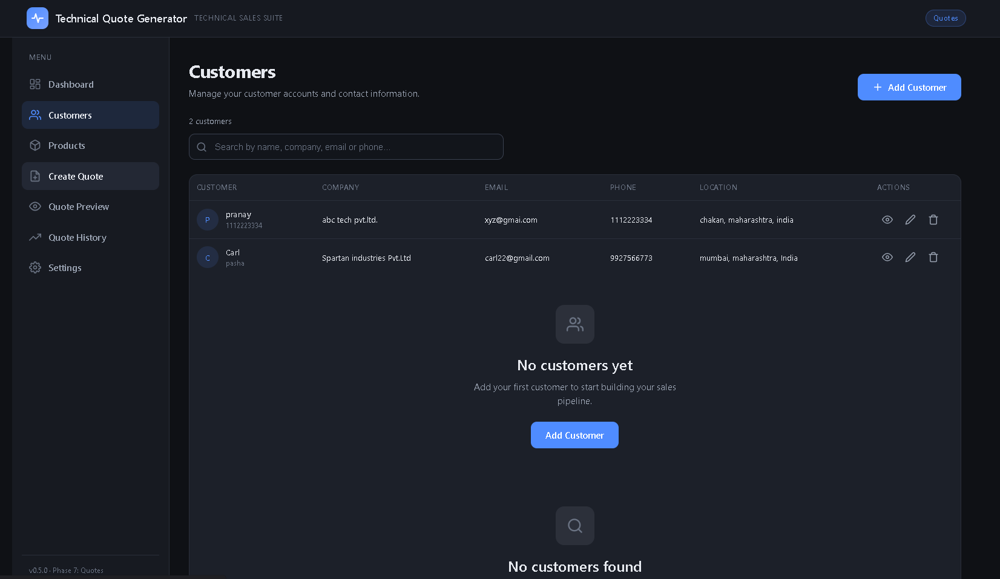
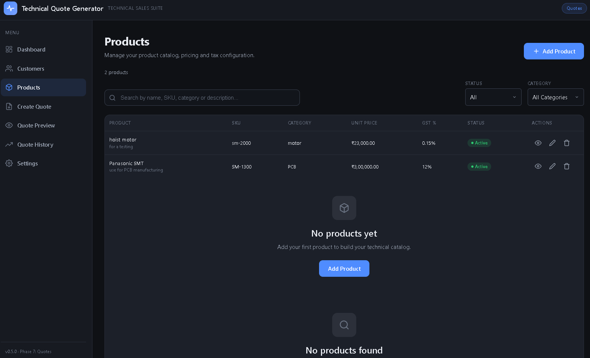

# Quotation Generator

A web-based application for creating and managing professional quotations. It provides an easy-to-use interface for entering customer and quotation details, calculating totals, previewing quotations, and generating PDF documents.

## ✨ Features

- Create professional quotations
- Add and manage customer details
- Add products and quotation line items
- Automatic calculation of:
  - Subtotal
  - Discount
  - GST
  - Grand Total
- Quote preview
- Print quotation
- Download quotation as PDF
- Quote history
- Company information and quotation settings
- Payment terms and notes
- Responsive and user-friendly interface

## 🛠️ Technologies Used

- HTML5
- CSS3
- JavaScript
- jsPDF
- GitHub

## 📂 Project Structure

```text
Quotation-Generator/
│
├── index.html
├── style.css
├── app.js
├── fonts.js
├── screenshots/
│   ├── dashboard.png
│   ├── customers.png
│   ├── products.png
│   ├── create-quote.png
│   ├── quote-history.png
│   ├── quote-preview.png
│   └── company-details.png
│
└── README.md

## 📸 Screenshots
## 📸 Screenshots

### Dashboard


### Customers


### Products


### Create Quote


### Quote History


### Quote Preview


### Company Details

